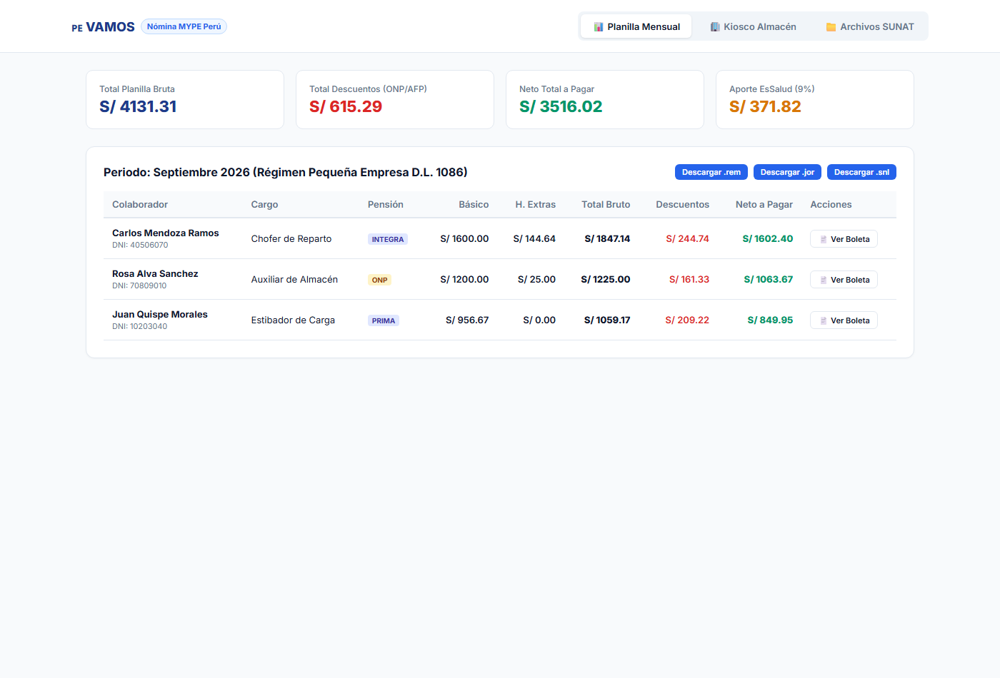
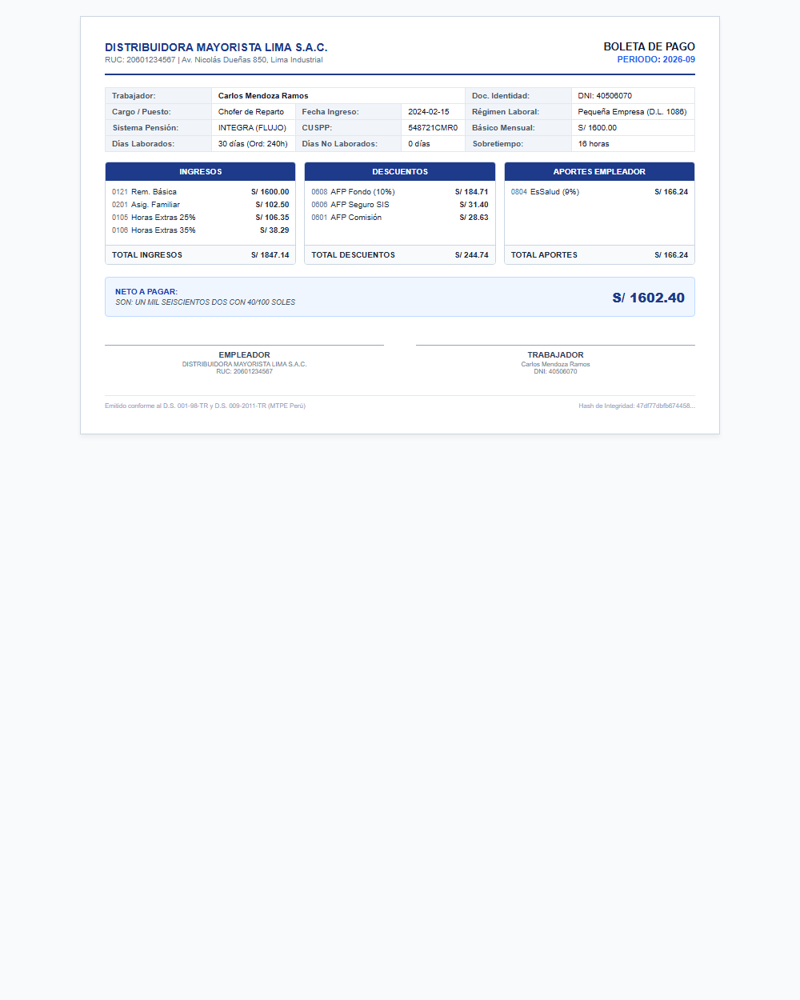
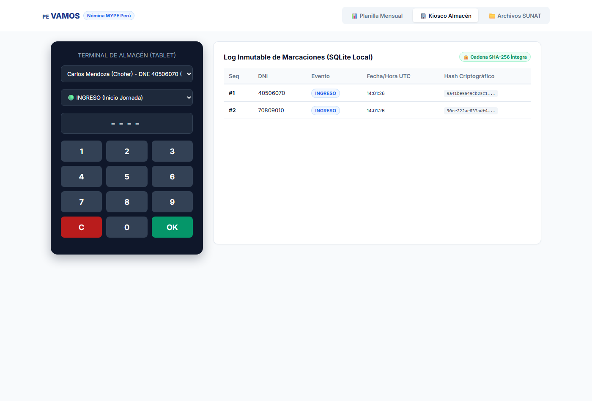

# 🇵🇪 VAMOS — Estándar Open-Core de Nómina y Asistencia Operativa

[](LICENSE)
[](https://nodejs.org/)
[]()
[]()
[]()
[]()

> **Estándar de software abierto, auditable y modular** para la liquidación de nómina (Pequeña Empresa D.L. 1086 y Régimen General D.L. 728), compilación de archivos planos para **PDT-PLAME v4.5**, generación de **Boletas de Pago oficiales (MTPE)** y control de **asistencia operativa offline-first** en pequeñas y medianas empresas del Perú.

---

## 🎯 ¿Por qué este proyecto?

En el mercado peruano, las soluciones de nómina y recursos humanos presentan tres problemas críticos:
1. **Caja Negra Propietaria:** Las suites corporativas cerradas no permiten al contador auditar cómo se calculan las horas extras, la Renta de 5ta Categoría o las alícuotas diarias, forzando a las empresas a pagar contratos anuales de miles de dólares.
2. **Desconexión Operativa y Caídas de Conectividad:** Los almacenes sufren cortes de internet y luz. Si el sistema de asistencia depende de la nube, una caída de red impide el marcaje ante inspecciones inopinadas de SUNAFIL.
3. **Falta de Trazabilidad en Boletas de Pago:** La dispersión entre Excel y sistemas aislados genera descuadres entre lo declarado en PDT-PLAME y lo entregado al trabajador en su boleta física o digital.

**VAMOS** unifica todo el flujo: **Marcaje en Kiosco $\to$ Motor de Reglas $\to$ Archivos SUNAT $\to$ Boleta de Pago en 1 Clic**, con 100% de trazabilidad y exactitud matemática.

---

## 📸 Evidencia Visual y Arquitectura en Funcionamiento

### 1. Dashboard Ejecutivo de Nómina y Exportación SUNAT PLAME
Visualización consolidada de conceptos remunerativos, cálculo automático de retenciones ONP/AFP y descarga inmediata de los archivos planos oficiales `.rem`, `.jor` y `.snl`.



### 2. Boleta de Pago Oficial A4 (Normativa MTPE D.S. 001-98-TR)
Generación instantánea con formato de 3 columnas (Ingresos, Descuentos, Aportes Patronales), desglose de horas extras, texto de moneda legal en letras en Soles y hash de verificación SHA-256 no sensible.

<div align="center">
  
</div>

### 3. Terminal Kiosco de Asistencia Offline-First
Terminal de marcación para tablet en piso de almacén con teclado PIN y encadenamiento criptográfico SHA-256 inmutable sobre SQLite nativo (prevención de fraude ante inspecciones inopinadas de SUNAFIL).



---

## 🏛️ Marco Normativo y de Seguridad Implementado

| Dominio | Base Legal / Estándar | Implementación en Código |
| :--- | :--- | :--- |
| **Régimen Pequeña Empresa** | **D.L. 1086 (REMYPE)** | Vacaciones 15 días, Gratificación (1/2 sueldo + 9% EsSalud), CTS (1/2 sueldo anual), EsSalud 9%. |
| **Horas Extras Diurnas** | **D.S. 007-2002-TR (Art. 10)** | Alícuota horaria base sobre 240 horas mensuales. 25% las 2 primeras horas, 35% las restantes. |
| **Sobretasa Nocturna** | **D.S. 007-2002-TR (Art. 8)** | Garantía de remuneración mínima nocturna (RMV + 35% = S/ 1,383.75). Diferencial horario automático entre 10:00 PM y 6:00 AM. |
| **Boletas de Pago Oficiales** | **D.S. 001-98-TR y D.S. 009-2011-TR** | Formato de 3 columnas (Ingresos, Descuentos, Aportes Patronales), texto de moneda en letras en Soles, espacios de firma y hash de verificación SHA-256 no sensible. |
| **Asistencia en Almacén** | **Guía MTPE 2024 (Registro de Asistencia)** | Registro de 4 eventos: `INGRESO`, `SALIDA_REFRIGERIO`, `RETORNO_REFRIGERIO` y `SALIDA`. |
| **Integridad Offline** | **Criptografía SHA-256 (Hash Chaining)** | Cada marcaje incluye el hash del evento anterior. Modificar cualquier registro en SQLite rompe la cadena automáticamente. |
| **Anti-Fuerza Bruta (PIN)** | **Seguridad por Diseño** | Rate limiter estricto: 3 intentos fallidos de PIN bloquean el terminal por 60 segundos. |
| **Archivos Planos PDT-PLAME v4.5** | **R.S. 204-2025/SUNAT** | Estructuras oficiales obligatorias: `.jor` (jornada/sobretiempo), `.snl` (suspensiones/faltas) y `.rem` (conceptos remunerativos). |

---

## 📦 Estructura de Paquetes del Monorepo

```
vamos-payroll-standard/
├── packages/
│   ├── engine/                    # Motor puro de cálculo laboral (Sin dependencias externas)
│   │   ├── src/
│   │   │   ├── parameters.ts      # RMV, UIT, tablas AFP y redondeo SUNAT
│   │   │   ├── types.ts           # Modelos de datos del empleado, asistencias y boletas
│   │   │   ├── rules/             # Reglas laborales parametrizadas
│   │   │   ├── engine.ts          # Orquestador del cálculo con Audit Trail legal
│   │   │   └── index.ts
│   │   └── tests/
│   │       └── payroll.test.ts    # 10 pruebas unitarias de cálculo laboral
│   ├── plame-compiler/            # Compilador y validador de archivos PDT-PLAME v4.5
│   │   ├── src/
│   │   │   ├── catalogs.ts        # Tablas oficiales SUNAT (Tabla 03, Tabla 21, Tabla 22)
│   │   │   ├── validator.ts       # Validador de consistencia y formato
│   │   │   ├── compiler.ts        # Generador de archivos .rem, .jor y .snl (CRLF)
│   │   │   └── index.ts
│   │   └── tests/
│   │       └── plame.test.ts      # 6 pruebas de integración SUNAT
│   ├── attendance-core/           # Módulo de asistencia offline-first para Kiosco Tablet
│   │   ├── src/
│   │   │   ├── security/          # SHA-256 hash chaining y rate limiting de PIN
│   │   │   ├── storage/           # SQLite local con Node 24 native DatabaseSync
│   │   │   ├── types.ts           # Eventos MTPE y contingencia USB
│   │   │   └── index.ts
│   │   └── tests/
│   │       └── attendance.test.ts # 6 pruebas de integridad offline y rate-limiting
│   └── payslip-pdf/               # Generador de Boletas de Pago formales (D.S. 001-98-TR)
│       ├── src/
│       │   ├── utils/             # Conversor de importes a letras en Soles
│       │   ├── generator.ts       # Plantilla A4 imprimible con hash criptográfico
│       │   ├── types.ts           # Información del empleador y colaborador
│       │   └── index.ts
│       └── tests/
│           └── payslip.test.ts    # 4 pruebas de cumplimiento de formato MTPE
├── package.json                   # Configuración de workspaces y scripts de test
└── README.md
```

---

## ⚡ Inicio Rápido (Quickstart)

El proyecto utiliza **Node.js 24+** con soporte nativo para TypeScript y SQLite embebido (cero dependencias externas).

### 1. Ejecutar las 26 Pruebas Unitarias del Monorepo

```bash
# Ejecuta todos los tests de nómina, PLAME, kiosco offline y boletas en ~190ms
node --test --experimental-strip-types packages/engine/tests/payroll.test.ts packages/plame-compiler/tests/plame.test.ts packages/attendance-core/tests/attendance.test.ts packages/payslip-pdf/tests/payslip.test.ts
```

**Resultado verificado:**
```text
▶ Offline-First Attendance Core (@payroll/attendance-core)
  ✔ 6 pruebas de encadenamiento SHA-256, rate-limiting y contingencia USB (14.2ms)
▶ Peruvian Payroll Engine (@payroll/engine)
  ✔ 10 casos de prueba de nómina MYPE / Régimen General (6.9ms)
▶ Peruvian Payslip Generator (@payroll/payslip-pdf)
  ✔ 4 pruebas de formato legal MTPE, importes a letras y hash de integridad (5.3ms)
▶ PDT-PLAME v4.5 Compiler (@payroll/plame-compiler)
  ✔ 6 pruebas de exportación .jor, .snl, .rem y tablas SUNAT (4.6ms)

ℹ tests 26 | pass 26 | fail 0 | duration_ms 199.1ms
```

---

## 💻 Ejemplo: Generación de Boleta de Pago Formal

```typescript
import { calculateEmployeePayroll } from '@payroll/engine';
import { generatePayslip } from '@payroll/payslip-pdf';

const company = {
  ruc: '20601234567',
  razonSocial: 'DISTRIBUIDORA LIMA NORTE S.A.C.',
  direccion: 'Av. Materiales 1234, Cercado de Lima',
};

const employee = {
  id: 'EMP-001',
  docType: 'DNI' as const,
  docNumber: '40506070',
  fullName: 'Carlos Mendoza',
  cargo: 'Chofer de Reparto',
  fechaIngreso: '2024-01-15',
  regime: 'PEQUENA_EMPRESA' as const,
  pensionSystem: 'ONP' as const,
  commissionType: 'FLUJO' as const,
  baseSalary: 1500.00,
  hasFamilyAllowance: true,
  hireDate: '2024-01-15',
};

const attendance = {
  daysInMonth: 30,
  daysWorked: 30,
  regularHours: 240,
  overtimeHours25: 10,
  overtimeHours35: 4,
  nightHours: 0,
  tardyMinutes: 0,
  daysAbsentUnjustified: 0,
  daysSubsidized: 0,
  daysUnpaidLeave: 0,
};

const payroll = calculateEmployeePayroll(employee, attendance, { year: 2026, month: 9, periodLabel: '2026-09' });

// Generar Boleta de Pago oficial
const payslip = generatePayslip({
  company,
  employee,
  attendance,
  payroll,
});

console.log('Neto a pagar:', payslip.netPay);
console.log('Texto en letras:', payslip.amountInWords);
// "SON: UN MIL CUATROCIENTOS DIECISEIS CON 13/100 SOLES"

console.log('Hash de integridad no sensible:', payslip.verificationHash);
// Documento HTML A4 imprimible con estilos CSS y espacios de firma listo en payslip.htmlContent
```

---

## 📄 Licencia

Este proyecto está bajo la licencia **GNU Affero General Public License v3.0 (AGPLv3)**.
