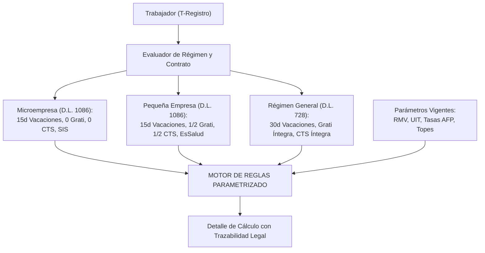
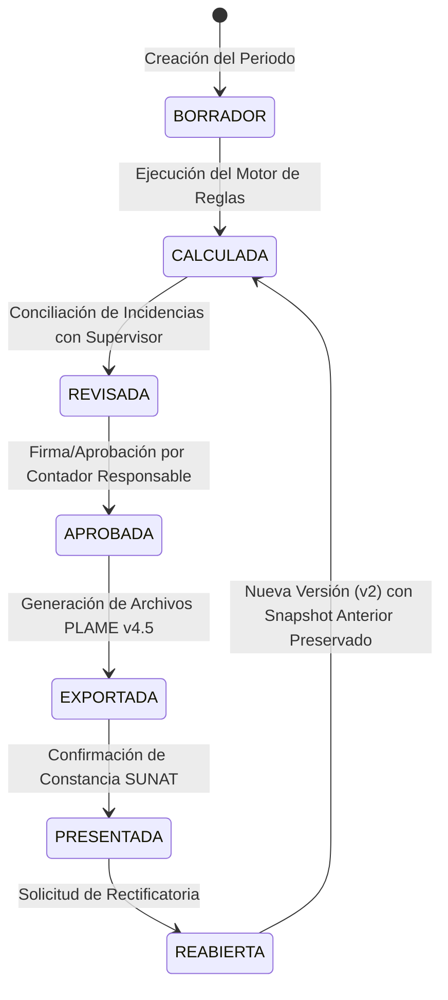

# 00. BLUEPRINT MAESTRO REFACTORIZADO: ESTÁNDAR OPEN-CORE PARA PILOTO CERRADO
## Arquitectura de Nómina Auditable y Asistencia Operativa (Perú)

**Proyecto:** Estándar de Software Open-Core de Nómina y Asistencia para PyMEs  
**Estado:** **APROBADO EXCLUSIVAMENTE PARA PILOTO CERRADO (2 A 5 EMPRESAS)**  
**Licenciamiento:** AGPLv3 (Núcleo abierto inspeccionable) + Servicios de Nube/Compliance  
**Marco Legal y Tributario:** SUNAT (T-Registro, PDT-PLAME v4.5 obligatoria desde Oct 2025), D.L. 1086 (REMYPE), D.L. 728, MTPE (Guía Asistencia 2024), D.S. 016-2024-JUS (Reglamento Ley 29733).  
**Enfoque:** Fórmulas de cálculo abiertas e inspeccionables, cero vendor lock-in y flujo de excepción auditable con supervisión contable humana.

---

## 1. DESMITIFICACIÓN Y POSICIONAMIENTO COMPETITIVO REALISTA (ANTI-BUK REAL)

Se eliminan todas las afirmaciones no sustentadas de que los incumbentes "no pueden hacer offline o GPS".

```
===================================================================================================
MATRIZ DE DIFERENCIACIÓN REAL Y COMPROBABLE FRENTE A BUK / TALANA
===================================================================================================
```

| Dimensión | Buk / Suites Tradicionales de RR.HH. | Estándar Open-Core (Nuestra Propuesta) |
| :--- | :--- | :--- |
| **Arquitectura de Software** | Software propietario cerrado ("Caja Negra"). El contador no puede auditar el código de las fórmulas. | **Código Abierto Inspeccionable:** Las fórmulas (`overtime.ts`, `taxes.ts`) son 100% auditables por el contador en GitHub. |
| **Vendor Lock-in y Portabilidad** | Alta fricción de salida. Dependencia total del hosting y servidores del proveedor. | **Cero Vendor Lock-in:** Base de datos PostgreSQL estándar; la PyME puede auto-hospedarla gratis o contratar la nube gestionada. |
| **Modelo Comercial y Compromiso** | Contratos anuales corporativos con mínimos de facturación y setup de $500–$1,000 USD. | **Adopción Modular sin Permanencia:** Diseñado para presupuestos de pequeñas distribuidoras (15–30 colaboradores). |
| **Garantía Legal** | Respaldada por marca comercial corporativa y equipo legal. | **Herramienta de Soporte con Aprobación Humana:** El software asiste en el cálculo; la validación final siempre la emite el contador responsable. |

> **Regla de Comunicación Comercial:** Queda **estrictamente prohibido** publicitar "cero riesgo de multas" o "software 100% certificado por SUNAFIL". El producto se comunica como: *"Herramienta en validación para asistir en el cálculo transparente de nómina y preparar archivos para revisión del contador"*.

---

## 2. GOBERNANZA DE CUMPLIMIENTO: MOTOR DE REGLAS MULTIDIMENSIONAL

Se prohíbe el archivo estático `mype.ts`. La nómina peruana se modela como un **motor de reglas versionadas por periodo** que discrimina entre regímenes y derechos contractuales:



### 2.1 Esquema de Dimensiones de cada Regla (`PayrollRule`)
Cada regla de cálculo debe registrar obligatoriamente:
1. **Régimen:** General, Pequeña Empresa, Microempresa.
2. **Vigencia:** Fecha de inicio y fecha de fin (ej. vigencia de RMV o tablas de AFP).
3. **Fuente Legal:** Base legal exacta (ej. Ley 27735, D.S. 001-97-TR, R.S. SUNAT).
4. **Remuneración Computable:** Matriz explícita de qué conceptos integran la base de cálculo para gratificaciones, CTS y vacaciones.
5. **Redondeo y Truncamiento:** Especificación matemática formal de decimales por concepto según estándar SUNAT.

---

## 3. MÁQUINA DE ESTADOS FINITA DEL CICLO DE NÓMINA

Una nómina mensual no puede ser alterada sin auditoría. Se implementa el siguiente ciclo de vida inmutable:



* **Regla de Inmutabilidad:** Al pasar al estado `APROBADA`, el snapshot de la nómina se congela y se genera un hash criptográfico.
* **Reapertura / Rectificatorias:** Si el contador detecta un error tras exportar, la nómina pasa a estado `REABIERTA`. El sistema **no sobreescribe** la versión anterior; genera una versión `v2`, calcula las diferencias netas y documenta el motivo del cambio y el usuario responsable.

---

## 4. ARQUITECTURA TÉCNICA DE REDUCCIÓN EN FASES (PILOTO CERRADO)

Se abandona la pretensión de construir todo en 30 días. El desarrollo se divide en fases estrechas condicionadas a gates:

| Fase | Alcance Técnico Estricto | Criterio de Salida (Gate) |
| :--- | :--- | :--- |
| **MVP 1** | • Motor de cálculo puro para **Pequeña Empresa** (1 solo régimen).<br>• Importación manual de reporte de asistencia en Excel.<br>• Conciliación contra planillas reales anonimizadas. | Conciliación al 100% en 30 casos de prueba con un contador responsable. |
| **MVP 2** | • Exportación de archivos planos para **PDT-PLAME v4.5** (.rem, .jor, .snl).<br>• Validación contra la estructura oficial de SUNAT.<br>• Boleta PDF interna con identificador seguro (sin QR público). | Aceptación sin errores en el validador oficial de SUNAT. |
| **MVP 3** | • Kiosco Almacén (PWA / SQLite offline) con reloj monotónico local.<br>• Rate-limiting en PIN (bloqueo progresivo tras 3 fallos).<br>• Cola de sincronización local encriptada y log *tamper-evident*. | Prueba de desconexión forzada de 48h con 0 pérdida de eventos ni duplicados. |
| **Piloto 2** | • App móvil con marcaje GPS por evento para choferes.<br>• Detección `isMockLocation()` como bandera técnica de auditoría (sin sanción automática).<br>• Evaluación de impacto de privacidad (D.S. 016-2024-JUS). | Aceptación formal de política de privacidad por choferes y supervisor. |
| **Post-Piloto** | • AFPnet masivo, integraciones contables y nube multi-tenant. | Aprobación de los Gates de Escala tras 3 ciclos paralelos exitosos. |

---

## 5. POLÍTICA DE SEGURIDAD Y PRIVACIDAD LABORAL (D.S. 016-2024-JUS)

1. **Minimización de Coordenadas:** Las coordenadas GPS se capturan **únicamente al pulsar el botón de marcaje**. Se prohíbe el rastreo en segundo plano.
2. **Tratamiento de `isMockLocation()`:** Si el teléfono reporta ubicación simulada, el evento se registra normalmente con una etiqueta interna `[SEÑAL_MOCK_DETECTADA]` y entra a la bandeja de revisión humana del supervisor. Nunca se bloquea al trabajador ni se rechaza el evento sin intervención humana.
3. **Seguridad del Kiosco Tablet:**
   * Rate limiting: Bloqueo de ingreso por 1 minuto tras 3 intentos fallidos de PIN.
   * Reloj monotónico: Detección de alteraciones manuales en la hora del sistema operativo de la tablet; registro del timestamp del dispositivo y timestamp del servidor al sincronizar.
   * Exportación de contingencia USB: Archivo cifrado con clave pública, solo descifrable por el administrador del sistema.

---

## 6. GOBERNANZA OPEN-CORE Y LICENCIAMIENTO

* **Núcleo Abierto (Licencia AGPLv3):**  
  Motor de cálculo (`@payroll/engine`), Kiosco básico de asistencia offline y compiladores de archivos planos. Todo usuario que modifique el código y lo ofrezca como servicio en red debe liberar las modificaciones bajo AGPLv3.
* **Módulos y Servicios Comerciales (Propietarios):**  
  Servicio de hosting gestionado multi-tenant, SLA de soporte normativo ante cambios de SUNAT, conectores directos a ERPs y panel de administración para estudios contables.
