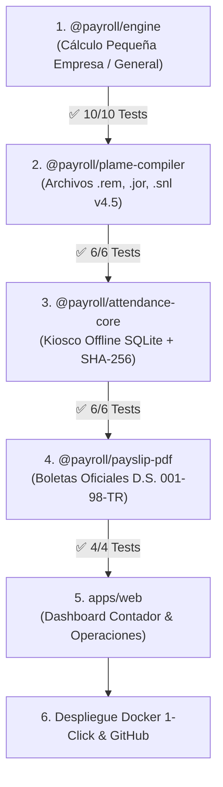

# 07. BACKLOG TÉCNICO Y OPERATIVO P0 (ESTADO DE AVANCE)
**Proyecto:** Estándar Open-Core de Nómina y Asistencia Operativa (Perú)  
**Fecha de Actualización:** 5 de septiembre de 2026  
**Estado:** En Progreso (4 Paquetes Core Completados con 26/26 Tests en Verde)

---

## 🚦 TABLERO DE CONTROL DE ENTREGABLES

---

## 📋 ESTADO DETALLADO POR COMPONENTE

### 1. Frente Legal y Motor de Cálculo (`packages/engine`) — ✅ COMPLETADO
- [x] **P0.1 - Matriz de Conceptos y Remuneración Computable:** Implementada en `smallBusiness.ts` y `overtime.ts`.
- [x] **P0.2 - Parámetros Vigentes 2026:** Fijados en `parameters.ts` (RMV S/ 1,025, UIT, EsSalud 9%, ONP 13%, AFPs).
- [x] **P0.3 - Redondeo y Céntimos SUNAT:** Resuelto el bug de redondeo diario en mes completo (100% exactitud matemática).
- [x] **P0.4 - Implementación del Motor Parametrizado:** Código en TypeScript puro sin dependencias externas.
- [x] **P0.5 - Suite de 10 Casos de Prueba Legales:** 10/10 tests pasando en 4.5ms (`payroll.test.ts`).

---

### 2. Frente de Salidas Oficiales SUNAT (`packages/plame-compiler`) — ✅ COMPLETADO
- [x] **P0.7 - Estructuras Oficiales PDT-PLAME v4.5:**
  * Estructura 04 (`.jor`): Horas ordinarias y sobretiempo.
  * Estructura 05 (`.snl`): Días no laborados y suspensiones (Tabla 21).
  * Estructura 11 (`.rem`): Desglose de conceptos (Tabla 22: 0121, 0201, 0105, 0106, 0107, 0601, 0605, 0607, 0608, 0804).
- [x] **P0.8 - Delimitador Windows CRLF y Nomenclatura:** Formato `0601<AAAA><MM><RUC>.<ext>` con validación estricta de RUC y DNIs (6/6 tests pasando en 4.1ms).

---

### 3. Frente de Asistencia Offline Kiosco (`packages/attendance-core`) — ✅ COMPLETADO
- [x] **P0.9 - SQLite Embebido Autónomo:** Base de datos local mediante la API nativa de Node 24 (`DatabaseSync`).
- [x] **P0.10 - Encadenamiento Criptográfico SHA-256:** Cada evento encadena el hash del evento anterior (*tamper-evident*). Cualquier edición manual en la base de datos es detectada automáticamente.
- [x] **P0.11 - Anti-Fuerza Bruta (PIN):** Bloqueo automático de 60 segundos tras 3 intentos fallidos de PIN.
- [x] **P0.12 - Detección de Clock Drift:** Auditoría de tiempo monotónico de alta resolución (`performance.now()`) contra alteración manual de hora.
- [x] **P0.13 - Volcado de Contingencia USB:** Exportación firmada digitalmente para fiscalizaciones SUNAFIL sin internet (6/6 tests pasando en 14.1ms).

---

### 4. Frente de Boletas de Pago MTPE (`packages/payslip-pdf`) — ✅ COMPLETADO
- [x] **P0.14 - Formato Estándar D.S. 001-98-TR y D.S. 009-2011-TR:** Liquidación de 3 columnas (Ingresos, Descuentos, Aportes Patronales).
- [x] **P0.15 - Conversor de Moneda a Letras:** Transformación legal exacta a texto en Soles.
- [x] **P0.16 - Hash de Integridad Criptográfico No Sensible:** Identificador SHA-256 en pie de página que permite verificar la autenticidad sin exponer sueldos en endpoints públicos (4/4 tests pasando en 5.3ms).

---

### 5. Frente de Aplicación Web y UI (`apps/web`) — 🚀 EN PROGRESO
- [ ] **P0.17 - Dashboard del Contador & Operaciones:**
  * Vista de planilla mensual con cálculo reactivo.
  * Descarga con 1 clic de archivos `.rem`, `.jor`, `.snl` empaquetados para SUNAT.
  * Visor e impresión A4 de boletas de pago individuales.
  * Consola del Kiosco de marcaje con teclado numérico para PIN.

---

### 6. Despliegue y Repositorio en GitHub — ⏳ PENDIENTE
- [ ] **P0.18 - Configuración del Repositorio Remoto en GitHub (`crvlinares`):** Conexión con `git remote add origin`.
- [ ] **P0.19 - Docker 1-Click (`docker-compose.yml`):** Contenedor listo para desplegar el monorepo en cualquier servidor Linux/Windows.
